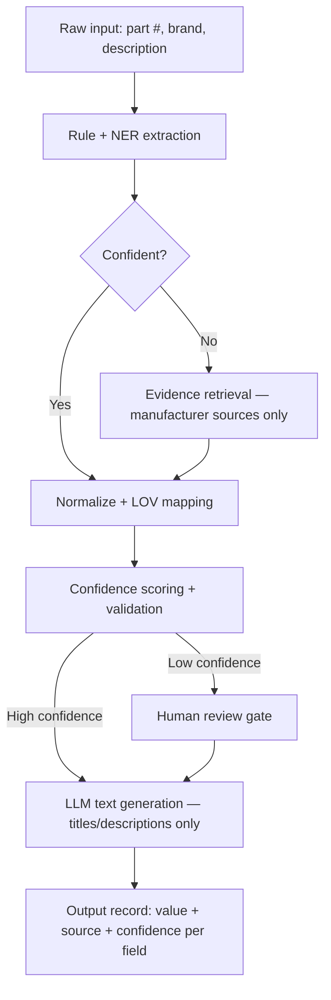

# SpecForge — Evidence-Grounded Product Intelligence Pipeline

> Built for **Unilog UniHack 2026** — "AI-Powered Product Intelligence" challenge (Jul 29 – Aug 23, 2026)

**Team:** THE AIB
**Repo:** https://github.com/rohitdecodes/SpecForge

---

## 1. Problem statement

Unilog's challenge: turn **minimal product input** — a manufacturer part number, brand, and a one-line description (e.g. `"3/8 CPLG BRS 150#"`) — into a **rich, commerce-ready product record**: a title, short/long descriptions, and validated attribute fields, all conforming to controlled vocabularies (LOVs) and unit rules.

The judging bar isn't just "does it produce fields" — it's **accuracy, explainability, LOV compliance, and trustworthiness**. A system that confidently invents a spec is worse than one that says "I don't know."

## 2. Our approach, in one sentence

A **deterministic-first cascade**: cheap, verifiable methods (regex, dictionaries) run first on every item; expensive methods (retrieval, LLM) only fire when the cheap pass leaves a field unresolved or low-confidence; the LLM is never allowed to be the source of a fact — only to extract from evidence we've already retrieved, or to paraphrase already-validated fields into copy.

### Why this, and not a simpler design

| Alternative | Why we didn't pick it alone |
|---|---|
| Single-prompt LLM (e.g. raw GPT call) | Hallucinates specs with no way to catch it; not zero-cost; no provenance |
| Pure rules/regex engine | Deterministic and explainable, but brittle — doesn't generalize past hand-coded patterns |
| Pure RAG + LLM | Grounds answers, but running retrieval on every field for every item is slow and wastes calls on fields regex already solves |
| Full multi-agent system | Modular and explainable, but the orchestration overhead isn't worth it for a ~200-item batch |
| Full knowledge graph | Best-in-class accuracy/explainability in theory, but graph schema design and population cost far more time than we have |

Our pipeline borrows the *strengths* of RAG (grounding), multi-agent design (modularity, swappable stages), and knowledge graphs (provenance per field) — without paying the full cost of any one of them. The ordering (deterministic → escalate only on failure) is what keeps it zero-cost and fast enough to run on a laptop.

## 3. Architecture



**Stage-by-stage:**

1. **Rule + NER extraction** — regex and a synonym dictionary parse the short description (`BRS`→Brass, `CPLG`→Coupling, `150#`→150 psi). Resolves most fields at zero AI cost.
2. **Evidence retrieval (conditional)** — only for fields the rule layer couldn't resolve confidently. Pulls manufacturer pages/PDFs by part number, embeds and indexes them (FAISS + sentence-transformers), returns the most relevant snippet.
3. **Normalize + LOV mapping** — every value is mapped to an approved controlled-vocabulary term and a standard unit (`pint` for conversions).
4. **Confidence scoring + validation** — each field gets a score: exact match to evidence = high, fuzzy match = medium, missing/conflicting = low.
5. **Human review gate** — anything below the confidence threshold is flagged `Needs Review` instead of guessed. Never silently published.
6. **LLM text generation** — a small open-weight instruct model turns the now-validated field set into a title and short/long description. It only ever reformulates known-good facts — it does not supply new ones.
7. **Output record** — one JSON/SQLite record per product: `{ value, source, extraction_method, confidence }` per field. This is our lightweight, provenance-carrying stand-in for a full knowledge graph.

### Example provenance record

```json
{
  "part_number": "3/8-CPLG-BRS-150",
  "brand": "AcmeCorp",
  "attributes": {
    "material": {
      "value": "Brass",
      "source": "rule:BRS->Brass",
      "confidence": "high"
    },
    "pressure": {
      "value": "150 psi",
      "source": "acmecorp.com/datasheets/cplg-3-8.pdf p.2",
      "confidence": "high"
    }
  },
  "needs_review": false
}
```

## 4. Tech stack (open-source / zero-cost only)

| Layer | Tool | Notes |
|---|---|---|
| Extraction (rules) | Python `re`, custom dictionaries, `spaCy` | No AI cost |
| Unit conversion | `pint` | Standardizes to approved UOMs |
| Embeddings | `sentence-transformers` (e.g. `all-MiniLM-L6-v2`) | Free, small, CPU-friendly |
| Vector index | `faiss-cpu` | Local, no hosting cost |
| Document parsing | `PyMuPDF`, `requests`/`BeautifulSoup` | For manufacturer PDFs/pages |
| LLM (extraction fallback + generation) | Open-weight instruct model — Phi-4-mini-instruct or Qwen2.5/3 (3B–8B) for CPU-only; Mistral-class model if a free GPU (Colab) is available | Never used as a source of facts, only extraction-over-evidence and paraphrasing |
| Storage | SQLite / JSON | Provenance record per product |
| Review interface | Streamlit or CSV | Minimal HITL surface |

No paid APIs anywhere in the production path. If a GPT-class model is used at all, it's only as an offline baseline for comparison metrics, not part of the system.

## 5. Evaluation plan

Measured against the provided 200-item ground truth:

- **Field-level accuracy** — exact match rate per attribute
- **LOV compliance** — % of output values found in the approved vocabulary
- **UOM compliance** — % of units in correct approved abbreviation
- **Description length compliance** — % within character limits
- **Human-review rate** — % of fields flagged, as a proxy for honesty about uncertainty
- **Baseline comparison** — same metrics run against a naive single-prompt LLM call, to show the delta our grounding buys

## 6. Project structure

```
.
├── data/
│   ├── raw/               # 1000 input rows, 2 ground-truth delivery rows
│   ├── lov/               # LOV/unit JSON files (Phase 1)
│   ├── processed/         # field_inventory.md (Phase 1)
│   ├── eval/              # dev ground truth (Phase 2)
│   └── cache/             # fetched web pages, gitignored (Phase 2)
├── src/
│   ├── extraction/        # regex + NER rules (Phase 1) + llm_extract (Phase 2)
│   ├── retrieval/         # search, fetch, parse, index (Phase 2)
│   ├── normalization/     # LOV + unit mapping (Phase 1)
│   ├── brand/             # brand resolution waterfall (Phase 2)
│   ├── confidence/        # scoring + review-flag logic (Phase 2)
│   ├── generation/        # LLM title/description generation (Phase 2)
│   └── pipeline.py        # orchestrates the cascade end-to-end (Phase 2)
├── tests/                 # pytest test files
├── scripts/               # build_lov.py, smoke_rules.py
├── docs/
│   ├── PHASE_1.md
│   ├── PHASE_2.md
│   ├── PHASE_1_SUMMARY.md
│   └── PHASE_2_SUMMARY.md
├── requirements.txt
└── README.md
```

## 7. Setup

```bash
python -m venv venv
source venv/bin/activate      # Windows: venv\Scripts\activate
pip install -r requirements.txt
```

`requirements.txt` (draft — confirm versions during Phase 1):
```
pandas
spacy
sentence-transformers
faiss-cpu
transformers
pint
pymupdf
requests
beautifulsoup4
streamlit
```

## 8. Execution roadmap

Built in three phases, each with its own detailed step-by-step plan (`docs/PHASE_N.md`) written for execution by an agentic coding assistant with a verifiable to-do list.

| Phase | Goal | Status |
|---|---|---|
| **Phase 1 — Foundation** | Data audit, deterministic extraction layer, LOV/unit tables for the target category | ✅ Complete — 27 tests pass, summary at `docs/PHASE_1_SUMMARY.md` |
| **Phase 2 — Grounding** | Evidence retrieval, LLM integration (extraction fallback + generation), confidence scoring | 🔨 In progress — see `docs/PHASE_2.md` |
| **Phase 3 — Trust & polish** | Human review interface, evaluation harness, baseline comparison, demo prep | Not started |

*(Detailed plan for the active phase lives in `docs/PHASE_N.md`.)*

## 9. Confirmed after Phase 1

- **Real dataset**: 1000 input rows, only 2 ground-truth delivery rows (both dishwashers). Phase 2 hand-curates a 20-row dev ground truth.
- **Deep-focus categories**: **Abrasives / Cut-Off Discs** (108 rows, mfr Milwaukee Accessory) and **Appliances** (84 rows, mfr APPDE co-op). Lighting (167 rows) and Decking (55 rows) are present but not in deep focus.
- **Rule-layer resolves 16 attributes** at rates from 73.7% (`part_number_echo`) down to 0% (`sound_level`). Deterministic 0% coverage on: Mounting Type, Voltage Rating, Amperage Rating, Size, Sound Level — these must come from Phase 2 retrieval.
- **`E1_Brand` is `-- Unbranded --`** in 799/1000 rows; `DIB_Brand` has real values for 245 rows. Phase 2 must resolve brand from `Part_Manuf` or retrieval.
- **All Phase 1 LOV entries are traceable** to real dataset tokens (verified by pytest).

---

*Acknowledgment: built for Unilog's UniHack 2026 "AI-Powered Product Intelligence" challenge.*
