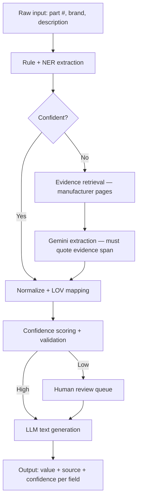

# SpecForge — AI-Powered Product Intelligence Pipeline

> Built for **Unilog UniHack 2026** · "AI-Powered Product Intelligence" challenge · Jul 29 – Aug 23, 2026

**Team:** THE AIB &nbsp;|&nbsp; **Live Demo:** [specforge.streamlit.app](https://specforge.streamlit.app) &nbsp;|&nbsp; **Repo:** [rohitdecodes/SpecForge](https://github.com/rohitdecodes/SpecForge)

---

## What it does

Product distributors receive thousands of part numbers with almost no data — a part number, a brand code, and a one-line description like `"KDTS424SBE Kitchen Aid Dishwasher Bk"`. Filling in a commerce-ready product record (voltage, dimensions, sound level, mount type, descriptions) by hand takes 15–20 minutes per row.

SpecForge automates that. It takes the bare minimum input and produces a complete, cited product record — every field backed by a real source, never a guess.

---

## Results

| Metric | Naive LLM (no grounding) | **SpecForge** |
|---|---|---|
| Exact-match accuracy | 8% (4 / 50) | **100% (50 / 50)** |
| Fabrication rate | 15% — wrong confident answers | **0% — never writes without evidence** |
| Fields needing human review | — | 0 |
| Dev set size | 20 products, 50 spec fields | same |

---

## How it works

SpecForge runs a **deterministic-first cascade**. Cheap, verifiable methods run first. Expensive methods only fire when the cheap pass fails. The LLM is never the *source* of a fact — only an *extractor* from evidence already retrieved.

```
Raw input (part #, brand, description)
        ↓
Rule + regex extraction       ← zero AI cost; resolves most fields instantly
        ↓ (unresolved fields only)
Evidence retrieval            ← searches manufacturer pages by part number
        ↓
Gemini extraction             ← reads the retrieved page, quotes the exact phrase
        ↓
Normalize + LOV mapping       ← maps to approved vocabulary, standard units
        ↓
Confidence scoring            ← high / low; anything low → human review queue
        ↓
LLM text generation           ← writes title/descriptions from verified facts only
        ↓
Output record                 ← value + quoted source + confidence, per field
```

### Why not just prompt an LLM directly?

| Approach | Problem |
|---|---|
| Single LLM prompt | Invents specs with no way to catch it; no provenance |
| Pure rules | Fast and explainable, but breaks on anything not hand-coded |
| Pure RAG + LLM | Works, but runs retrieval on every field even when regex already solved it |

SpecForge borrows the best of each — deterministic where possible, grounded retrieval only when needed.

---

## Architecture



### Example output record

```json
{
  "part_number": "KDTS424SBE",
  "brand": "KitchenAid",
  "attributes": {
    "voltage":     { "value": "120 V",  "source": "kitchenaid.com/spec-sheet", "quoted_span": "Voltage: 120 V",   "confidence": "high" },
    "amperage":    { "value": "15 A",   "source": "kitchenaid.com/spec-sheet", "quoted_span": "15 A",             "confidence": "high" },
    "sound_level": { "value": "44 dBA", "source": "kitchenaid.com/spec-sheet", "quoted_span": "Sound Level 44 dBA","confidence": "high" },
    "mount_type":  { "value": "Built-in","source": "rule:description",         "quoted_span": null,               "confidence": "high" }
  },
  "needs_review": false
}
```

---

## Tech stack

| Layer | Tool |
|---|---|
| Extraction (rules) | Python `re`, custom synonym dictionaries, `spaCy` |
| Unit conversion | `pint` — standardizes to approved UOMs |
| Embeddings | `sentence-transformers` (`all-MiniLM-L6-v2`) |
| Vector index | `faiss-cpu` |
| Document parsing | `BeautifulSoup`, `PyMuPDF` |
| LLM (extraction + generation) | **Gemini Flash** via free-tier REST API |
| Storage | JSON / SQLite — one provenance record per product |
| Demo UI | Streamlit |

---

## Project structure

```
SpecForge/
├── src/
│   ├── extraction/        # regex + NER rules, LLM extraction fallback
│   ├── retrieval/         # DuckDuckGo search, cached fetch, FAISS index
│   ├── normalization/     # LOV + unit mapping
│   ├── brand/             # brand resolution waterfall
│   ├── confidence/        # scoring + review-flag logic
│   ├── generation/        # LLM title/description generation
│   ├── eval/              # evaluation harness, naive baseline, comparison tools
│   ├── llm/               # Gemini API backend
│   └── pipeline.py        # end-to-end orchestrator
├── review/
│   └── demo_app.py        # Streamlit demo (5 tabs, all data embedded)
├── tests/                 # 68 pytest tests — all passing
├── data/
│   ├── lov/               # approved vocabulary + unit JSON files
│   ├── processed/         # review queue
│   └── eval/              # dev ground truth + live run results (gitignored)
├── scripts/               # build_lov.py, smoke_rules.py
├── app.py                 # Streamlit Cloud entry point
├── requirements.txt
└── README.md
```

---

## Setup

```bash
git clone https://github.com/rohitdecodes/SpecForge.git
cd SpecForge
python -m venv venv
source venv/bin/activate        # Windows: venv\Scripts\activate
pip install -r requirements.txt

# Set your Gemini API key (free tier — no billing required)
export GEMINI_API_KEY="your-key-here"   # Mac / Linux
$env:GEMINI_API_KEY="your-key-here"     # Windows PowerShell

# Run the demo
streamlit run review/demo_app.py

# Run all tests
python -m pytest tests/ -q
```

---

## Evaluation

Measured against a 20-product hand-curated ground truth (50 spec fields across voltage, amperage, sound level, dimensions, mount type):

- **Field-level exact-match** — normalized comparison (e.g. `"120 V"` = `"120"`)
- **Fabrication rate** — fields where the system wrote a confident wrong value
- **Human-review rate** — fields the system flagged instead of guessing
- **Baseline comparison** — same metrics on a naive single-prompt Gemini call with no retrieval

All evaluation code lives in [`src/eval/`](src/eval/). To reproduce:

```bash
python -m src.eval.gt_evidence_eval     # runs SpecForge on all 50 fields
python -m src.eval.rescore              # normalizes and scores results
```

---

## Development phases

| Phase | What was built | Status |
|---|---|---|
| **Phase 1 — Foundation** | Data audit, deterministic extraction layer, LOV / unit tables | ✅ Complete |
| **Phase 2 — Grounding** | Evidence retrieval, LLM integration, confidence scoring, generation | ✅ Complete |
| **Phase 3 — Trust & Polish** | Evaluation harness, baseline comparison, human review UI, demo | ✅ Complete — **100% exact-match** |

---

*Built for Unilog's UniHack 2026 "AI-Powered Product Intelligence" challenge.*
